# SpringMVC第二天

## 内容概述

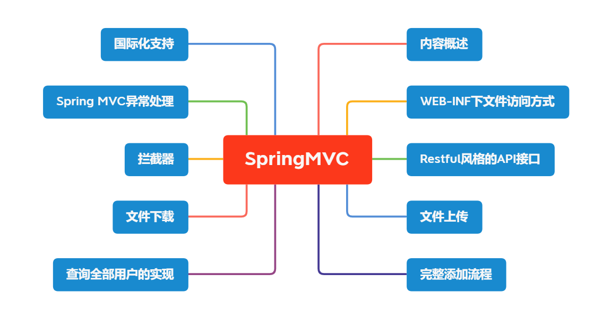

## WEB-INF下文件访问方式

### WEB-INF下文件访问方式

如果在WEB-INF目录下的jsp文件，如何进行访问呢？

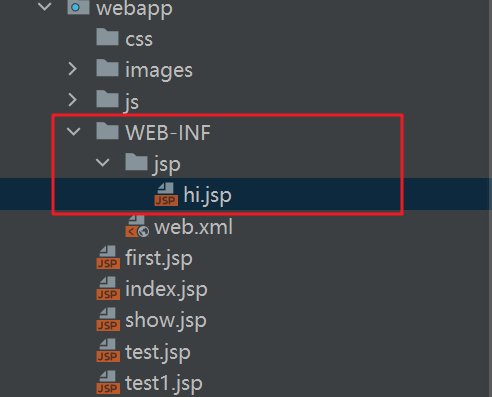

直接通过浏览器访问可以么？http://localhost:8080/demo01/WEB-INF/jsp/hi.jsp

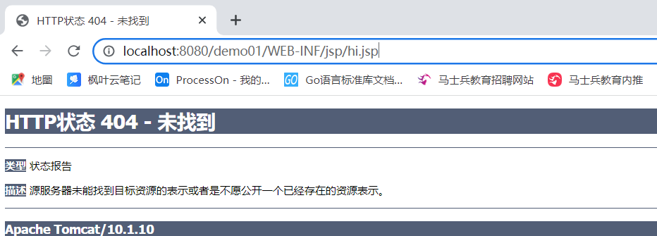

因为WEB-INF下,应用服务器把它指为禁访目录,即直接在浏览器里是不能访问到的。（web-inf下的静态资源可以通过静态资源放行配置后访问到，此处说的是非静态资源，如：jsp资源）

WEB-INF下的资源，可以通过控制单元进行请求转发，编写控制单元：

```java
package com.msb.controller;

import org.springframework.stereotype.Controller;
import org.springframework.web.bind.annotation.RequestMapping;

/**
 * @Author: zhaoss
 */
@Controller
public class MyController4 {
    @RequestMapping(value="/testwebinf1")
    public String testwebinf1(){
        System.out.println("走入testwebinf1方法");
        // 请求转发到WEB-INF/jsp/hi.jsp
        return "WEB-INF/jsp/hi.jsp";
    }
}

```

这样就可以访问了：http://localhost:8080/demo01/testwebinf1

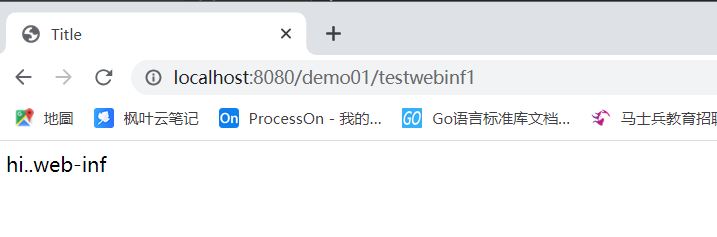

### 自定义视图解析器

如果控制类中的控制单元都是跳转到WEB-INF/jsp目录下，如：

```java
package com.msb.controller;

import org.springframework.stereotype.Controller;
import org.springframework.web.bind.annotation.RequestMapping;

/**
 * @Author: zhaoss
 */
@Controller
public class MyController4 {
    @RequestMapping(value="/testwebinf1")
    public String testwebinf1(){
        System.out.println("走入testwebinf1方法");
        // 请求转发到WEB-INF/jsp/hi.jsp
        return "WEB-INF/jsp/hi.jsp";
    }
    @RequestMapping(value="/testwebinf2")
    public String testwebinf2(){
        System.out.println("走入testwebinf2方法");
        // 请求转发到WEB-INF/jsp/hi.jsp
        return "WEB-INF/jsp/hi.jsp";
    }
    @RequestMapping(value="/testwebinf3")
    public String testwebinf3(){
        System.out.println("走入testwebinf3方法");
        // 请求转发到WEB-INF/jsp/hi.jsp
        return "WEB-INF/jsp/hi.jsp";
    }
}

```

**需要简化控制单元返回值的情况**下可以自定义视图解析器。

所以我们可以自定义视图解析器，在springmvc.xml中加入：

```xml
<!--配置自定义试图解析器-->
<bean id="viewResolver" class="org.springframework.web.servlet.view.InternalResourceViewResolver">
    	<!-- 前缀 -->
        <property name="prefix" value="/WEB-INF/jsp/"></property>
    	<!-- 后缀 -->
        <property name="suffix" value=".jsp"></property>
</bean>
```

加入视图解析器后，控制类可以简化为：

```java
package com.msb.controller;

import org.springframework.stereotype.Controller;
import org.springframework.web.bind.annotation.RequestMapping;

/**
 * @Author: zhaoss
 */
@Controller
public class MyController4 {
    @RequestMapping(value="/testwebinf1")
    public String testwebinf1(){
        System.out.println("走入testwebinf1方法");
        // 请求转发到WEB-INF/jsp/hi.jsp
        return "hi";
    }
    @RequestMapping(value="/testwebinf2")
    public String testwebinf2(){
        System.out.println("走入testwebinf2方法");
        // 请求转发到WEB-INF/jsp/hi.jsp
        return "hi";
    }
    @RequestMapping(value="/testwebinf3")
    public String testwebinf3(){
        System.out.println("走入testwebinf3方法");
        // 请求转发到WEB-INF/jsp/hi.jsp
        return "hi";// 由视图解析器拼接：prefix + hi + suffix。具体：/WEB-INF/jsp/ + hi + .jsp
    }
}

```

这样也是没有问题的。对于这种，项目结构比较固定，页面按照一定规则放在特定位置，且返回值内容比较长时，就可以配置视图解析器。

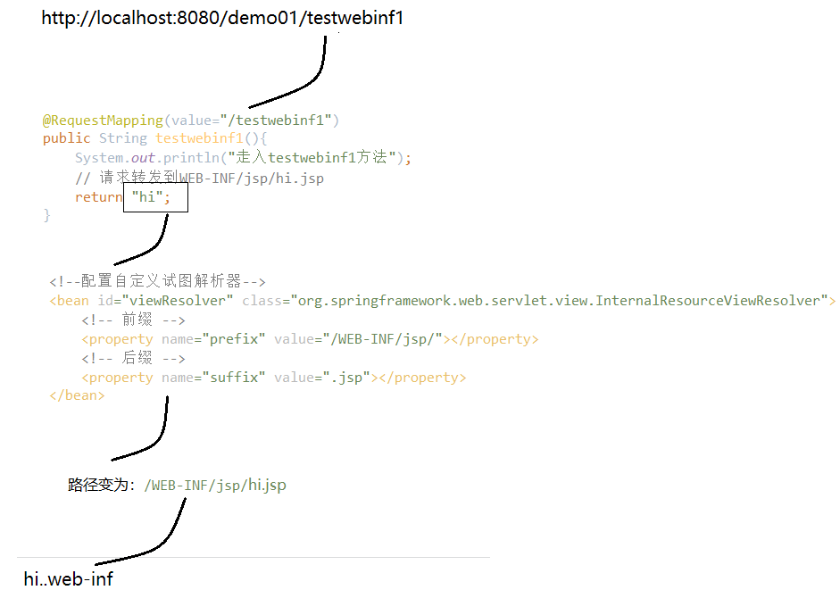

### 自定义视图解析器下跳转到其他控制器

当自定义视图解析器后，返回值前面和后面都会固定拼接字符串（在没有使用其他注解情况下）。但是如果想要控制单元跳转到非视图解析器指定的位置，那么需要在返回值前面明确添加forward:或redirect: ，这样就不走自定义的视图解析器了，如下：

```java
    @RequestMapping(value="/testwebinf4")
    public String testwebinf4(){
        System.out.println("走入testwebinf4方法");
        return "forward:/index.jsp";
    }
```

这样访问http://localhost:8080/demo01/testwebinf4就会请求转发到webapp目录下的index.jsp页面。

### WEB-INF目录下资源互相访问

如果在hi.jsp想要跳转到hello.jsp怎么处理呢？

在hi.jsp中加入超链接:

```jsp
<%--
  Created by IntelliJ IDEA.
  User: zhaoss-msb
  Date: 2023/8/3
  Time: 13:24
  To change this template use File | Settings | File Templates.
--%>
<%@ page contentType="text/html;charset=UTF-8" language="java" %>
<html>
<head>
    <title>Title</title>
</head>
<body>
  hi..web-inf 
  <a href="testwebinf5">跳转到hello.jsp</a>  
</body>
</html>

```

href中定义的是控制单元地址，在控制单元中完成跳转：

```java
    @RequestMapping(value="/testwebinf5")
    public String testwebinf5(){
        // 请求转发到WEB-INF/jsp/hello.jsp
        return "hello";
    }
```


先通过控制单元请求到hi.jsp再点击超链接进入hello.jsp中。

## Restful风格的API接口

### Restful风格的API接口出现的原因

移动互联网时代，客户端不仅限于PC浏览器，也可能是移动APP，或是小程序：

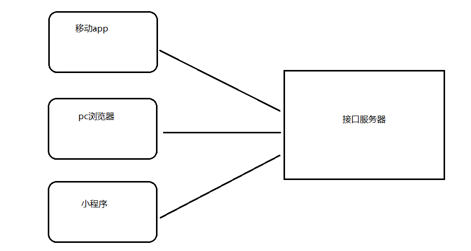

此时就需要接口服务器对外提供一套统一的API接口。这个API接口在编写的时候就需要遵照一定的规则。

因为后端开发人员有很多，不只是一个人，这时候不同的开发人员开发风格不同，如果规范不统一，会出现什么问题？比如一个新增逻辑，不同的开发人员定义的url：

```java
http://localhost:8080/demo01/add
http://localhost:8080/demo01/save
http://localhost:8080/demo01/newUser
http://localhost:8080/demo01/zengjia
...等
```

每个人的规范不同，那么编写API接口的习惯自然不同。这样就会造成同一个类型的接口的所提供的路径千奇百怪，这样客户端调用的时候就会频繁切换不同风格的路径去调用，无形中增加了别人的劳动量和精力。

为了避免上述情况发生，所有人如果进行同一个项目的开发，那么就遵循一套相同的逻辑，如何优雅的、科学的去统一这套api呢？

答案：项目接口设计的时候遵循restful规范，此项目接口也就是具有restful风格的API接口。

### 考虑1：路径设计

路径的设计：由当前接口操作的资源决定，比如接口操作的对应是用户，路径可设计为：/user

### 考虑2：参数的传递

比如在进行查询指定用户id的用户时候，传统方式中查询用户的访问路径写法:http://localhost:8080/demo01/user?id=1

上面在参数传递的过程中，其实我们真正想要传递的数据是1，所以既然你的目的就是传递数据，那么可否写成下面的方式呢？http://localhost:8080/demo01/user/1,此时后端控制单元怎么处理呢？

```java
package com.msb.controller;

import com.msb.pojo.User;
import org.springframework.stereotype.Controller;
import org.springframework.web.bind.annotation.PathVariable;
import org.springframework.web.bind.annotation.RequestMapping;

/**
 * @Author: zhaoss
 */
@Controller
public class MyController5 {
    @RequestMapping(value="/user/{id}") // 前端传过来的参数就会给id
    public User selectOneUser(@PathVariable Integer id){
        //想要在方法中使用id，就需要将参数id指定为上面的id，此时需要@PathVariable注解，这样传过来的参数才会被方法的参数接收到
        // 方法的参数名字必须和路径中名称保持一致
        // 下面这句代码，是模拟从业务层获取到User对象：
        User user = new User();
        return user;
    }
}

```

启动服务器测试，前端：

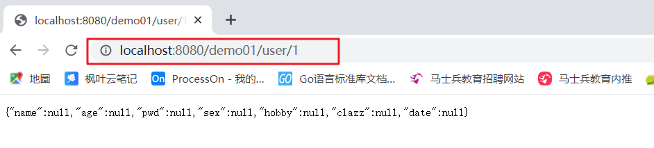

后端：

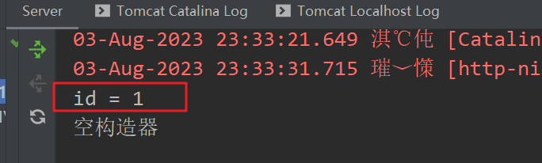

### 考虑3：请求方式

但是这样又出现了新的问题，就是如何区分不同的操作调用不同的功能方法处理呢？比如删除和查询的url地址就是一样的怎么区分不同的操作呢?如：

删除用户: http://localhost:8080/demo01/user/1

查询用户:http://localhost:8080/demo01/user/1

此时就需要借助请求方式：

HTTP协议中支持很多种请求方式，除了GET和POST还有PUT和DELETE等，restful中要求使用不同的请求方式来标记对资源的操作方式，达到调用不同的后台功能方法来处理请求的目的。

具体的请求方式根据接口对资源的操作决定，增post  删delete  改put  查get

```
在 Restful 风格中，现有规定如下：
GET（SELECT）：从服务器查询，可以在服务器通过请求的参数区分查询的方式。
POST（CREATE）：在服务器端新建一个资源，调用 insert 操作。
PUT（UPDATE）：在服务器端更新资源，调用 update 操作。
PATCH（UPDATE）：在服务器端更新资源（客户端提供改变的属性）。(目前 jdk7 未实现，tomcat7不支持)。
DELETE（DELETE）：从服务器端删除资源，调用 delete 语句。
```

```java
/**
 * @RequestMapping注解可以接收任意请求方式的请求
 * @GetMapping("地址"):接收GET请求，一般用在查询方法上
 * @DeleteMapping("地址"):接收DELETE请求，一般用在删除方法上
 * @PostMapping("地址"):接收POST请求，一般用户在新增上
 * @PutMapping("地址"):接收PUT请求，一般用在修改上
 */
//查询用户信息
@GetMapping("/user/{id}")
public String selUser(@PathVariable Integer id){
    System.out.println("用户ID为:"+id);
    return "/success.jsp";
}
//删除用户信息
@DeleteMapping("/user/{id}")
public String delUser(@PathVariable Integer id){
    System.out.println("用户ID为:"+id);
    return "/success.jsp";
}
//新增用户信息
@PostMapping("/user/{id}/{name}/{age}")
public String addUser(@PathVariable Integer id,@PathVariable String name,@PathVariable Integer age){
    System.out.println("id = " + id + ", name = " + name + ", age = " + age);
    return "/success.jsp";
}
//修改用户信息
@PutMapping("/user/{id}/{name}")
public String updateUser(@PathVariable Integer id,@PathVariable String name){
    System.out.println("id = " + id + ", name = " + name);
    return "/success.jsp";
}
```


这样请求方式+路径参数即可确定要访问的具体的控制单元。


## 文件上传

把文件保存到服务器中，叫文件上传。

从服务器将文件下载到本地，叫文件下载。

以达到资源共享目的。

### 文件上传思路

如下文件上传的逻辑：

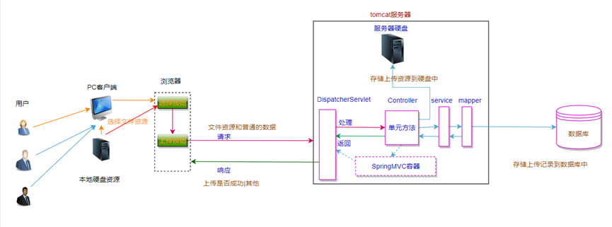

图片不是保存在数据库，而是上传到服务器磁盘中。

如果有其它表单信息，如用户名字、用户性别、还有你要保存的图片的文件名称，一起保存到数据库。

在文件上传时文件和其他请求参数是在请求体中进行传递，所以不支持GET类型请求，要使用POST类型请求。GET请求方式提交的数据量大小有限制，如果文件过大肯定不能用GET方式。

### 前台页面的实现

文件上传的时机有两种：

**时机一**：选择好图片以后就直接上传——利用ajax方式（推荐）

**时机二**：选择好图片以后并不会直接上传，而是点击提交以后，将整个表单提交至后台。——利用非ajax方式

#### ajax方式

（1）导入jquery.js:

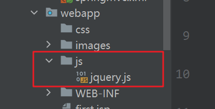

（2）注意对js文件放行，在springmvc.xml中加入：

```xml
<?xml version="1.0" encoding="UTF-8"?>
<beans xmlns="http://www.springframework.org/schema/beans"
       xmlns:mvc="http://www.springframework.org/schema/mvc"
       xmlns:xsi="http://www.w3.org/2001/XMLSchema-instance"
       xmlns:context="http://www.springframework.org/schema/context"
       xsi:schemaLocation="http://www.springframework.org/schema/beans
		https://www.springframework.org/schema/beans/spring-beans.xsd
        http://www.springframework.org/schema/context
        https://www.springframework.org/schema/context/spring-context.xsd
        http://www.springframework.org/schema/mvc
        https://www.springframework.org/schema/mvc/spring-mvc.xsd">


    <context:component-scan base-package="com.msb.controller"></context:component-scan>
    <mvc:annotation-driven></mvc:annotation-driven>
    <!-- 静态资源放行-->
    <mvc:resources mapping="/js/**" location="/js/"></mvc:resources>
 
</beans>
```

（3）save.jsp页面编写：

```jsp
<%--
  Created by IntelliJ IDEA.
  User: zhaoss-msb
  Date: 2023/8/4
  Time: 17:55
  To change this template use File | Settings | File Templates.
--%>
<%@ page contentType="text/html;charset=UTF-8" language="java" %>
<html>
<head>
    <title>Title</title>
    <script type="text/javascript" src="js/jquery.js"></script>
    <%--声明js代码域--%>
    <script type="text/javascript">
        /****************资源上传功能实现**********************************/
        $(function () {
            //给图片按钮绑定值改变事件
            $("#filebtn").change(function () {
                //获取要上传的文件资源
                var file=$("#filebtn")[0].files[0];
                //创建FormData对象存储要上传的资源(文件上传数据的载体)
                var formData = new FormData();
                formData.append("photo",file);
                //发起ajax请求完成文件上传
                $.ajax({
                    /*
                    在文件上传时文件和其他请求参数是在请求体中进行传递，
                    所以不支持GET类型请求，要使用POST类型请求。
                    GET请求方式提交的数据量大小有限制，
                    如果文件过大肯定不能用GET方式。
                     */
                    type:"post",//使用post类型的请求
                    data:formData,//请求数据
                    url:"upload",//请求地址
                    /*
                    如果该页面文件上传使用的是非ajax方式，那么必须在form表单中加入：
                    enctype="multipart/form-data"
                    加入该属性代表：表单提交的内容转为二进制方式
                    因为enctype默认值="application/x-www-form-urlencoded"，代表普通文本
                    姓名、年龄可以按照普通文本，但是文件不可以呀！
                    所以需要将表单提交的内容转为二进制方式
                    必须使用
                    enctype="multipart/form-data"

                    现在我们使用的是ajax方式，需要设置processData、contentType为false
                    ① 将processData属性的值设置为false，告诉浏览器发送对象请求数据
                    ② 将contentType属性的值设置为false，设置请求数据的类型为二进制类型。
                    所以enctype="multipart/form-data"等价于processData:false+contentType:false
                     */
                    processData:false,
                    contentType:false,
                    success:function (data) {//回调函数
						console.log(data)
                    }
                })
            })
        })
    </script>
</head>
<body>
<h1>用户账户注册</h1>
<form>
    <p>
        姓名：<input type="text" name="name"/>
    </p>
    <p>
        年龄：<input type="text" name="sex"/>
    </p>
    <p>
        头像：<input type="file" name="photo" id="filebtn"/>
    </p>
    <p>
        <input type="submit" value="提交"/>
    </p>
</form>
</body>
</html>

```


其中`var file=$("#filebtn")[0].files[0];`代表需要上传的文件，如何验证这段代码的含义，可以通过如下代码进行测试：

```jsp
<%--
  Created by IntelliJ IDEA.
  User: zhaoss-msb
  Date: 2023/8/4
  Time: 17:55
  To change this template use File | Settings | File Templates.
--%>
<%@ page contentType="text/html;charset=UTF-8" language="java" %>
<html>
<head>
    <title>Title</title>
    <script type="text/javascript" src="js/jquery.js"></script>
    <%--声明js代码域--%>
    <script type="text/javascript">
        /****************资源上传功能实现**********************************/
        $(function () {
            //给图片按钮绑定值改变事件
            $("#filebtn").change(function () {
                //获取要上传的文件资源
                var file=$("#filebtn");
                console.log(file);
            })
        })
    </script>
</head>
<body>
<h1>用户账户注册</h1>
<form>
    <p>
        姓名：<input type="text" name="name"/>
    </p>
    <p>
        年龄：<input type="text" name="sex"/>
    </p>
    <p>
        头像：<input type="file" name="photo" id="filebtn"/>
    </p>
    <p>
        <input type="submit" value="提交"/>
    </p>
</form>
</body>
</html>

```

前端控制台效果：

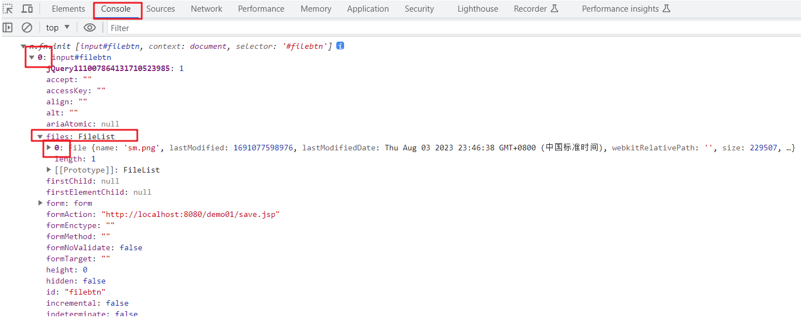

启动服务器，可以看到请求体中内容：binary文件对象，photo载体已经传过去了

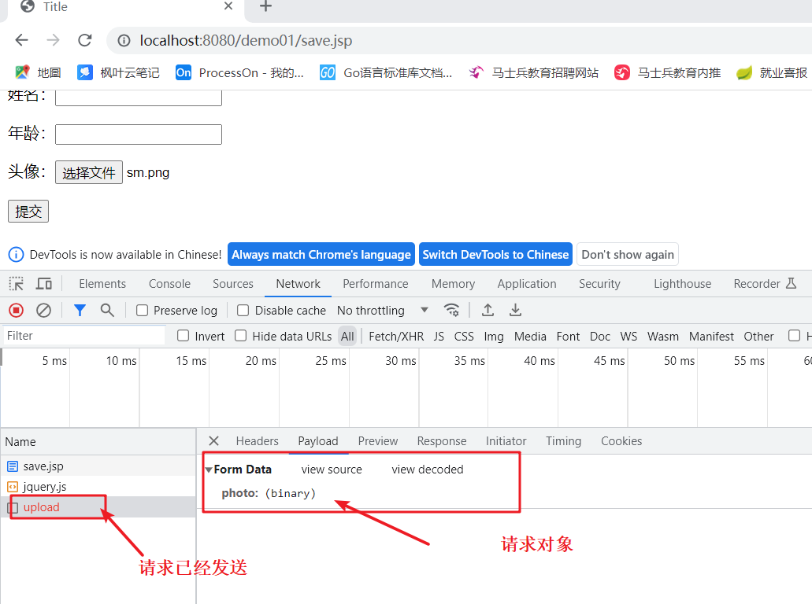

### 配置表单解析对象

如果后台想要接收前台传过来的文件数据，必须在springmvc.xml中配置表单解析对象。

只有配置了MultipartResovler，Spring MVC 才会解析上传文件流数据。

同时`<bean>`的id必须叫做multipartResovler，叫其他名字无效。

```xml
<!-- 文件上传时，必须配置文件解析器 -->
<bean id="multipartResolver" class="org.springframework.web.multipart.support.StandardServletMultipartResolver"></bean>
```

### multipart配置

这个新的解析器使用Servlet容器自带的multipart解析功能，而不再依赖于第三方库（如Apache Commons FileUpload）。要使用这个解析器，你需要在web.xml文件中配置如下的multipart配置：

```xml
<?xml version="1.0" encoding="UTF-8"?>
<web-app xmlns="http://xmlns.jcp.org/xml/ns/javaee"
         xmlns:xsi="http://www.w3.org/2001/XMLSchema-instance"
         xsi:schemaLocation="http://xmlns.jcp.org/xml/ns/javaee http://xmlns.jcp.org/xml/ns/javaee/web-app_4_0.xsd"
         version="4.0">

  <servlet>
    <servlet-name>springmvc</servlet-name>
    <servlet-class>org.springframework.web.servlet.DispatcherServlet</servlet-class>
    <init-param>
      <param-name>contextConfigLocation</param-name>
      <param-value>classpath:springmvc.xml</param-value>
    </init-param>
    <load-on-startup>1</load-on-startup>
    <!-- 新增 -->
    <multipart-config>
      <max-file-size>2097152</max-file-size>
      <max-request-size>4194304</max-request-size>
      <file-size-threshold>0</file-size-threshold>
    </multipart-config>
    <!--
        max-file-size: 指定上传文件允许的最大大小。 默认值为1MB
        max-request-size: 指定multipart/form-data请求允许的最大大小。 默认值为10MB。
        PS: 其中max-file-size指定的大小是单文件上传的大小限制，而max-request-size是一次请求的多个文件大小限制。
        location: 指定将存储上载文件的目录。 未指定时，将使用自定义目录。
        file-size-threshold: 指定文件将写入磁盘的大小阈值。 默认值为0。
    -->
  </servlet>
  <servlet-mapping>
    <servlet-name>springmvc</servlet-name>
    <url-pattern>/</url-pattern>
  </servlet-mapping>
</web-app>
```

### 后台控制单元实现

#### 存储图片在计算机的某个盘符

存储图片在计算机的某个盘符：如存储在计算机的D:/images/目录下

```java
package com.msb.controller;

import com.msb.pojo.User;
import jakarta.servlet.annotation.MultipartConfig;
import org.springframework.stereotype.Controller;
import org.springframework.web.bind.annotation.PathVariable;
import org.springframework.web.bind.annotation.RequestMapping;
import org.springframework.web.bind.annotation.ResponseBody;
import org.springframework.web.multipart.MultipartFile;

import java.io.File;
import java.io.IOException;

/**
 * @Author: zhaoss
 */
@Controller
@MultipartConfig
public class MyController6 {
    @RequestMapping(value="/upload")
    @ResponseBody
    public String upload(MultipartFile photo) throws IOException {//photo接收前台传过来的文件对象
        // 将传过来的图片放在d盘目录下,名字为原始资源名称
        File dir = new File("D:/images/");
        // 如果不存在则创建目录
        if(!dir.exists()){
            dir.mkdirs();
        }
        // 获取文件原始名字
        String originalFilename = photo.getOriginalFilename();
        // 文件存储位置拼接：意味着：存储在D:/images/a.png
        File file =new File(dir,originalFilename);
        //  文件保存
        photo.transferTo(file);
        return "ok";
    }
}

```

测试，运行结果ok

#### 保存文件到当前项目中

上面演示时是把图片保存到计算机的一个目录中，这样做的好处是每次重启项目文件也不会丢失，但是存储后的图片无法通过浏览器进行访问，无法对外共享。

所以我们可以把图片保存到项目中，这样在浏览器可以访问项目下的图片。

但是要注意的是图片需要保存到：Tomcat的目录的项目下。**目录为项目编译后发布到Tomcat的目录**。

修改控制单元为：

```java
package com.msb.controller;

import com.msb.pojo.User;
import jakarta.servlet.annotation.MultipartConfig;
import jakarta.servlet.http.HttpServletRequest;
import org.springframework.stereotype.Controller;
import org.springframework.web.bind.annotation.PathVariable;
import org.springframework.web.bind.annotation.RequestMapping;
import org.springframework.web.bind.annotation.ResponseBody;
import org.springframework.web.multipart.MultipartFile;

import java.io.File;
import java.io.IOException;

/**
 * @Author: zhaoss
 */
@Controller
@MultipartConfig
public class MyController6 {
    @RequestMapping("/upload2")
    @ResponseBody
    public String upload2(MultipartFile photo,HttpServletRequest req) throws IOException {
        // 把文件放在服务器目录：
        String realPath = req.getServletContext().getRealPath("/images");
        System.out.println(realPath);

        File dir = new File(realPath);
        if (!dir.exists()){// 如果目录不存在，创建目录
            dir.mkdirs();
        }

        // 获取上传图片的原始名字
        String originalFilename = photo.getOriginalFilename();

        // 文件存储位置拼接：存储d:/images/拼接图片原始名字 sm05.png
        // d:/images/sm05.png
        File file = new File(dir,originalFilename);
        // 文件保存：
        photo.transferTo(file);

        return "ok";
    }
}

```

重启服务器测试，图片可存入服务器：

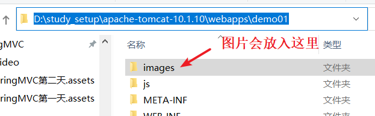


访问：http://localhost:8080/demo01/images/test.png即可访问到图片，注意如果想要这个访问生效，记得配置静态 资源放行

```xml
<mvc:resources mapping="/images/**" location="/images/"></mvc:resources>
```

注意：

服务器重启后，图片资源就没有了，但是用最开始存入盘符的形式，即使服务器停掉，图片仍然存在。

但是实际开发中服务器一般不会轻易停掉，所以你要想资源共享，就将图片上传到服务器目录下。

#### 生成唯一文件名

在上面代码中，保存文件名称时是使用文件上传时的名称进行保存。这样做存在一个问题：如果存在同名文件，后上传文件会覆盖之前文件内容。

所以在文件上传时都会生成一个全局唯一的文件名。常见有两种方式：

（1）时间戳+随机数

（2）UUID

文件名是全局唯一的，但是保存时文件扩展名要和上传文件的扩展名保持一致。

```java
package com.msb.controller;

import com.msb.pojo.User;
import jakarta.servlet.annotation.MultipartConfig;
import jakarta.servlet.http.HttpServletRequest;
import org.springframework.stereotype.Controller;
import org.springframework.web.bind.annotation.PathVariable;
import org.springframework.web.bind.annotation.RequestMapping;
import org.springframework.web.bind.annotation.ResponseBody;
import org.springframework.web.multipart.MultipartFile;

import java.io.File;
import java.io.IOException;
import java.util.Random;
import java.util.UUID;

/**
 * @Author: zhaoss
 */
@Controller
@MultipartConfig
public class MyController6 {
    @RequestMapping(value="/upload3")
    @ResponseBody
    public String upload3(MultipartFile photo, HttpServletRequest req) throws IOException {//photo接收前台传过来的文件对象
        // 把文件放在服务器目录：
        String realPath = req.getServletContext().getRealPath("/images");
        System.out.println(realPath);

        File dir = new File(realPath);
        if (!dir.exists()){// 如果目录不存在，创建目录
            dir.mkdirs();
        }

        // 获取上传图片的原始名字
        String originalFilename = photo.getOriginalFilename();
        // 获取文件后缀：
        String suffix = originalFilename.substring(originalFilename.lastIndexOf("."));


        // 创建文件唯一名字：
        // 方式1：利用时间戳+随机数+后缀：
        /*long time01 = System.currentTimeMillis();
        String filename = time01 + "" + new Random().nextInt(1000) + suffix;*/

        // 方式2：UUID
        UUID uuid = UUID.randomUUID();
        String filename = uuid + suffix;

        File file = new File(dir,filename);
        // 文件保存：
        photo.transferTo(file);
        return "ok";
    }
}

```


#### ajax响应部分处理

如果想要在控制单元返回一些数据，并且数据在前台可以接收处理，那么可以在控制单元中返回Map集合，然后再前台的ajax回调处理中获取Map集合，如：返回上传成功，在前台页面显示上传的图片（将图片进行回显）

后端：新增map集合的处理

```java
package com.msb.controller;

import jakarta.servlet.annotation.MultipartConfig;
import jakarta.servlet.http.HttpServletRequest;
import org.springframework.stereotype.Controller;
import org.springframework.web.bind.annotation.RequestMapping;
import org.springframework.web.bind.annotation.ResponseBody;
import org.springframework.web.multipart.MultipartFile;

import java.io.File;
import java.io.IOException;
import java.util.HashMap;
import java.util.Map;
import java.util.Random;

/**
 * @Author: zhaoss
 */
@Controller
@MultipartConfig
public class MyController6 {
    @RequestMapping(value="/upload3")
    @ResponseBody
    public Map upload3(MultipartFile photo, HttpServletRequest req) throws IOException {
        // 把文件放在服务器目录：
        String realPath = req.getServletContext().getRealPath("/images");
        System.out.println(realPath);

        File dir = new File(realPath);
        if (!dir.exists()){// 如果目录不存在，创建目录
            dir.mkdirs();
        }

        // 获取上传图片的原始名字
        String originalFilename = photo.getOriginalFilename();
        // 获取文件后缀：
        String suffix = originalFilename.substring(originalFilename.lastIndexOf("."));


        // 创建文件唯一名字：
        // 方式1：利用时间戳+随机数+后缀：
        /*long time01 = System.currentTimeMillis();
        String filename = time01 + "" + new Random().nextInt(1000) + suffix;*/

        // 方式2：UUID
        UUID uuid = UUID.randomUUID();
        String filename = uuid + suffix;

        File file = new File(dir,filename);
        // 文件保存：
        photo.transferTo(file);
        // 新增代码：
        Map map = new HashMap();
        map.put("msg",1);// 上传图片成功返回：码1
        map.put("filename",fileName);// 存入文件名字
		// 新增代码：
        return map;
    }
}

```

前端处理：

```jsp
<%--
  Created by IntelliJ IDEA.
  User: zhaoss-msb
  Date: 2023/8/4
  Time: 17:55
  To change this template use File | Settings | File Templates.
--%>
<%@ page contentType="text/html;charset=UTF-8" language="java" %>
<html>
<head>
    <title>Title</title>
    <script type="text/javascript" src="js/jquery.js"></script>
    <script type="text/javascript">
        $(function () {
            $("#filebtn").change(function () {
                var file=$("#filebtn")[0].files[0];
                var formData = new FormData();
                formData.append("photo",file);
                $.ajax({
                    type:"post",
                    data: formData,
                    url:"upload3",
                    processData:false,
                    contentType:false,
                    success:function (data) {//回调函数，新增处理
                        console.log(data)
                        if (data.msg == 1){
                            alert("上传成功")
                        }
                        $("#img_span").html("")

                    }
                })
            })
        })
    </script>
</head>
<body>
<h1>用户账户注册</h1>
<form>
    <p>
        姓名：<input type="text" name="name"/>
    </p>
    <p>
        年龄：<input type="text" name="sex"/>
    </p>
    <p>
        头像：<input type="file" name="photo" id="filebtn"/>
        <span id="img_span"></span> <%-- 新增处理--%>
    </p>
    <p>
        <input type="submit" value="提交"/>
    </p>
</form>
</body>
</html>

```

上面的响应如果不好使，请查看pom.xml中是否导入依赖：

```xml
   <dependency>
      <groupId>com.fasterxml.jackson.core</groupId>
      <artifactId>jackson-databind</artifactId>
      <version>2.15.2</version>
    </dependency>
```

## 完整添加流程

上面已经把文件上传功能实现好了，那么现在开始做整个表单的提交。

下面的案例要加入**ssm整合处理**。

### 修改前端页面

首先先把表单内容增多一些：

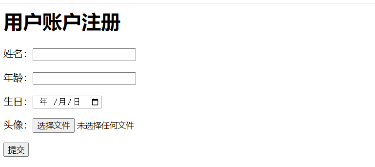

```jsp
<%--
  Created by IntelliJ IDEA.
  User: zhaoss-msb
  Date: 2023/8/4
  Time: 17:55
  To change this template use File | Settings | File Templates.
--%>
<%@ page contentType="text/html;charset=UTF-8" language="java" %>
<html>
<head>
    <title>Title</title>
    <script type="text/javascript" src="js/jquery.js"></script>
    <script type="text/javascript">
        $(function () {
            $("#filebtn").change(function () {
                var file=$("#filebtn")[0].files[0];
                var formData = new FormData();
                formData.append("photo",file);
                $.ajax({
                    type:"post",
                    data: formData,
                    url:"upload3",
                    processData:false,
                    contentType:false,
                    success:function (data) {
                        console.log(data)
                        if (data.msg == 1){
                            alert("上传成功")
                        }
                        $("#img_span").html("")
                    }
                })
            })
        })
    </script>
</head>
<body>
<h1>用户账户注册</h1>
<form>
    <p>
        姓名：<input type="text" name="name"/>
    </p>
    <p>
        年龄：<input type="text" name="sex"/>
    </p>
    <p>
        生日：<input type="date" name="birthdate"/>
    </p>
    <p>
        头像：<input type="file" name="photo" id="filebtn"/>
        <span id="img_span"></span><%----%>
    </p>
    <p>
        <input type="submit" value="提交"/>
    </p>
</form>
</body>
</html>

```


### 创建数据库表

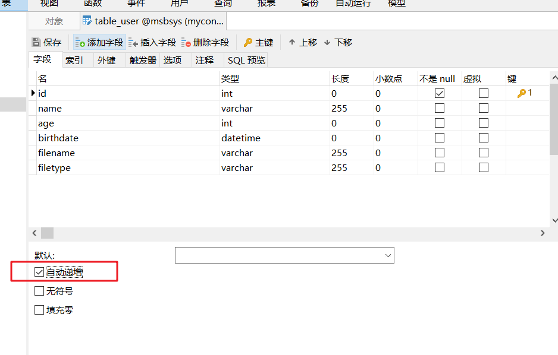


### 构建实体类

```java
package com.msb.pojo;

import com.fasterxml.jackson.annotation.JsonFormat;
import org.springframework.format.annotation.DateTimeFormat;

import java.util.Date;

/**
 * @Author: zhaoss
 */
public class LoginUser {
    private Integer id;
    private String name;
    private Integer age;

    
    @DateTimeFormat(pattern = "yyyy-MM-dd")// 接收日期的格式
    @JsonFormat(pattern = "yyyy-MM-dd")//响应日期的格式
    private Date birthdate;
    private String filename;
    private String filetype;

    public LoginUser(Integer id, String name, Integer age, Date birthdate, String filename, String filetype) {
        this.id = id;
        this.name = name;
        this.age = age;
        this.birthdate = birthdate;
        this.filename = filename;
        this.filetype = filetype;
    }

    public LoginUser() {
    }

    public Integer getId() {
        return id;
    }

    public void setId(Integer id) {
        this.id = id;
    }

    public String getName() {
        return name;
    }

    public void setName(String name) {
        this.name = name;
    }

    public Integer getAge() {
        return age;
    }

    public void setAge(Integer age) {
        this.age = age;
    }

    public Date getBirthdate() {
        return birthdate;
    }

    public void setBirthdate(Date birthdate) {
        this.birthdate = birthdate;
    }

    public String getFilename() {
        return filename;
    }

    public void setFilename(String filename) {
        this.filename = filename;
    }

    public String getFiletype() {
        return filetype;
    }

    public void setFiletype(String filetype) {
        this.filetype = filetype;
    }

    @Override
    public String toString() {
        return "LoginUser{" +
                "id=" + id +
                ", name='" + name + '\'' +
                ", age=" + age +
                ", birthdate=" + birthdate +
                ", filename='" + filename + '\'' +
                ", filetype='" + filetype + '\'' +
                '}';
    }
}

```

### 持久层

com.msb.mapper.UserMapper：

```java
package com.msb.mapper;


import com.msb.pojo.LoginUser;

/**
 * @Author: zhaoss
 */
public interface UserMapper {
    // 添加实现
    int insertUser(LoginUser user);
}
```

resources/com/msb/mapper/UserMapper.xml:

```xml
<?xml version="1.0" encoding="UTF-8" ?>
<!DOCTYPE mapper
        PUBLIC "-//mybatis.org//DTD Mapper 3.0//EN"
        "https://mybatis.org/dtd/mybatis-3-mapper.dtd">
<mapper namespace="com.msb.mapper.UserMapper">
    <insert id="insertUser">
        insert into table_user values(default,#{name},#{age},#{birthdate},#{filename},#{filetype})
    </insert>
</mapper>
```

### 业务层

com.msb.service.UserService:

```java
package com.msb.service;


import com.msb.pojo.LoginUser;

/**
 * @Author: zhaoss
 */
public interface UserService {
    int save(LoginUser user);
}

```


com.msb.service.impl.UserServiceImpl:

```java
package com.msb.service.impl;

import com.msb.mapper.UserMapper;
import com.msb.pojo.LoginUser;
import com.msb.service.UserService;
import org.springframework.beans.factory.annotation.Autowired;
import org.springframework.stereotype.Service;

/**
 * @Author: zhaoss
 */
@Service
public class UserServiceImpl implements UserService {
    @Autowired
    private UserMapper userMapper;
    @Override
    public int save(LoginUser user) {
        return userMapper.insertUser(user);
    }
}

```

### 控制层

com.msb.controller.UserController:

```java
package com.msb.controller;

import com.msb.pojo.LoginUser;
import com.msb.service.UserService;
import jakarta.servlet.annotation.MultipartConfig;
import jakarta.servlet.http.HttpServletRequest;
import org.springframework.beans.factory.annotation.Autowired;
import org.springframework.stereotype.Controller;
import org.springframework.web.bind.annotation.RequestMapping;
import org.springframework.web.bind.annotation.ResponseBody;
import org.springframework.web.multipart.MultipartFile;

import java.io.File;
import java.io.IOException;
import java.util.HashMap;
import java.util.Map;
import java.util.Random;

/**
 * @Author: zhaoss
 */
@Controller

public class UserController {
    
    @Autowired
    private UserService userService;
    @RequestMapping(value="/loginform")
    public String login(LoginUser user){
        int n = userService.save(user);
        if(n > 0){// 成功跳转success.jsp页面
            return "success.jsp";
        }
        return "fail.jsp";// 失败跳转到fail.jsp
    }
}

```


### 创建成功和失败页面

success.jsp：

```jsp
<%--
  Created by IntelliJ IDEA.
  User: zhaoss-msb
  Date: 2023/8/8
  Time: 19:53
  To change this template use File | Settings | File Templates.
--%>
<%@ page contentType="text/html;charset=UTF-8" language="java" %>
<html>
<head>
    <title>Title</title>
</head>
<body>
  添加数据成功
</body>
</html>

```

fail.jsp:

```jsp
<%--
  Created by IntelliJ IDEA.
  User: zhaoss-msb
  Date: 2023/8/8
  Time: 19:53
  To change this template use File | Settings | File Templates.
--%>
<%@ page contentType="text/html;charset=UTF-8" language="java" %>
<html>
<head>
    <title>Title</title>
</head>
<body>
添加数据失败
</body>
</html>

```


### 再次修改前端页面，添加隐藏数据

```jsp
<%--
  Created by IntelliJ IDEA.
  User: zhaoss-msb
  Date: 2023/8/4
  Time: 17:55
  To change this template use File | Settings | File Templates.
--%>
<%@ page contentType="text/html;charset=UTF-8" language="java" %>
<html>
<head>
    <title>Title</title>
    <script type="text/javascript" src="js/jquery.js"></script>
    <script type="text/javascript">
        $(function () {
            $("#filebtn").change(function () {
                var file=$("#filebtn")[0].files[0];
                var formData = new FormData();
                formData.append("photo",file);
                $.ajax({
                    type:"post",
                    data: formData,
                    url:"upload3",
                    processData:false,
                    contentType:false,
                    success:function (data) {
                        console.log(data)
                        if (data.msg == 1){
                            alert("上传成功")
                        }

                        $("#img_span").html("")
                        /*新增回显处理*/
                        $("#filename").val(data.filename);
                        $("#filetype").val(data.filetype);
                    }
                })
            })
        })
    </script>
</head>
<body>
<h1>用户账户注册</h1>
<form action="loginform">
    <p>
        姓名：<input type="text" name="name"/>
    </p>
    <p>
        年龄：<input type="text" name="age"/>
    </p>
    <p>
        生日：<input type="date" name="birthdate"/>
    </p>
    <p>
        头像：<input type="file" name="photo" id="filebtn"/>
        <span id="img_span"></span>
    </p>
    <p>
        <%--新增：隐藏数据的具体数值，在ajax请求文件回显的时候处理--%>
        <input type="hidden" name="filename" id="filename" >
        <input type="hidden" name="filetype" id="filetype" >
        <input type="submit" value="提交"/>
    </p>
</form>
</body>
</html>

```


在ajax文件上传对应控制单元中也要新增filetype的存储：

```java

@Controller
public class MyController6 {
    @RequestMapping(value="/upload3")
    @ResponseBody
    public Map upload3(MultipartFile photo, HttpServletRequest req) throws IOException {

        String originalFilename = photo.getOriginalFilename();

        String suffix = originalFilename.substring(originalFilename.lastIndexOf("."));
        long timeMillis = System.currentTimeMillis();
        String random = timeMillis + "" + new Random().nextInt(1000);

        String fileName = random + suffix;
        String realPath = req.getServletContext().getRealPath("/images");
        photo.transferTo(new File(realPath + "/" + fileName));

        Map map = new HashMap();
        map.put("msg",1);
        map.put("filename",fileName);
        map.put("filetype",photo.getContentType());// 新增：filetype文件类型的存储
        return map;
    }

    @Autowired
    private UserService userService;
    @RequestMapping(value="/loginform")
    public String login(LoginUser user){
        int n = userService.save(user);
        if(n > 0){
            return "success.jsp";
        }
        return "fail.jsp";
    }
}

```

测试即可成功。

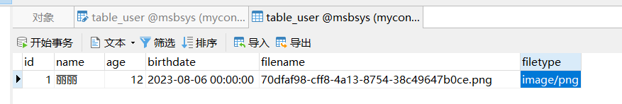

## 查询全部用户的实现

在上面的代码基础上完成查询逻辑：

### 持久层

com.msb.mapper.UserMapper:

```java
package com.msb.mapper;


import com.msb.pojo.LoginUser;

import java.util.List;

/**
 * @Author: zhaoss
 */
public interface UserMapper {
    List<LoginUser> selectAllUsers();
}
```

resources/com/msb/mapper/UserMapper.xml:

```xml
<?xml version="1.0" encoding="UTF-8" ?>
<!DOCTYPE mapper
        PUBLIC "-//mybatis.org//DTD Mapper 3.0//EN"
        "https://mybatis.org/dtd/mybatis-3-mapper.dtd">
<mapper namespace="com.msb.mapper.UserMapper">
    <select id="selectAllUsers" resultType="LoginUser" >
        select * from table_user
    </select>
</mapper>
```

### 业务层

com.msb.service.UserService:

```java
package com.msb.service;

import com.msb.pojo.LoginUser;
import java.util.List;

/**
 * @Author: zhaoss
 */
public interface UserService {
    List<LoginUser> findAll();
}

```

com.msb.service.impl.UserServiceImpl:

```java
package com.msb.service.impl;

import com.msb.mapper.UserMapper;
import com.msb.pojo.LoginUser;
import com.msb.service.UserService;
import org.springframework.beans.factory.annotation.Autowired;
import org.springframework.stereotype.Service;

import java.util.List;

/**
 * @Author: zhaoss
 */
@Service
public class UserServiceImpl implements UserService {
    @Autowired
    private UserMapper userMapper;
    @Override
    public List<LoginUser> findAll() {
        return userMapper.selectAllUsers();
    }
}

```

### 控制层

```java
package com.msb.controller;

import com.msb.pojo.LoginUser;
import com.msb.service.UserService;
import jakarta.servlet.annotation.MultipartConfig;
import jakarta.servlet.http.HttpServletRequest;
import org.springframework.beans.factory.annotation.Autowired;
import org.springframework.stereotype.Controller;
import org.springframework.web.bind.annotation.RequestMapping;
import org.springframework.web.bind.annotation.ResponseBody;
import org.springframework.web.multipart.MultipartFile;

import java.io.File;
import java.io.IOException;
import java.util.*;

/**
 * @Author: zhaoss
 */
@Controller
public class MyController6 {
        @RequestMapping(value="/findAllUsers")
    @ResponseBody
    public List<LoginUser> findAllUsers(LoginUser user){
        return userService.findAll();
    }
}

```


### 前端页面编写

编写showuser.jsp页面

```jsp
<%--
  Created by IntelliJ IDEA.
  User: zhaoss-msb
  Date: 2023/8/4
  Time: 17:55
  To change this template use File | Settings | File Templates.
--%>
<%@ page contentType="text/html;charset=UTF-8" language="java" %>
<html>
<head>
    <title>Title</title>
    <script type="text/javascript" src="js/jquery.js"></script>
    <script type="text/javascript">
        $(function () {
            alert("a")
            // 发送ajax请求
            $.ajax(
                {
                    type:"post",
                    url:"findAllUsers",
                    success:function(result){
                        $.each(result,function(i,e){// 对响应内容遍历
                            // 遍历的结果放入tbody中：
                            $("#tb").append("<tr>\n"+
                                " <th>"+e.id+"</th>\n"+
                                " <th>"+e.name+"</th>\n"+
                                " <th>"+e.age+"</th>\n"+
                                "<th>"+e.birthdate+"</th>\n"+
                                "<th>"+e.filename+"</th>\n"+
                                "<th>"+e.filetype+"</th>\n"+
                                "<th></th>\n"+
                                "<th><a href=''>下载</a></th>\n"+
                                "</tr>")
                        })
                    }
                }
            )
        })
    </script>
</head>
<body>
<%--
定义一个表来展示数据
table>tr>th*8 点击tab按键就可以显示8行
--%>
<table>
    <tr>
        <th>用户编号</th>
        <th>名字</th>
        <th>年龄</th>
        <th>出生日期</th>
        <th>文件名字</th>
        <th>文件类型</th>
        <th>图片</th>
        <th>操作</th>
    </tr>
    <tbody id="tb"></tbody>
</table>


</body>
</html>

```


### 测试

因为咱们现在的服务器每次启动图片都会消失，所以在测试的时候需要注意：

每次先访问save.jsp将图片存到服务器，然后访问showuser.jsp查询图片。

注意自己手动删除数据库的数据与服务器中图片保持一致，在测试阶段只能用这种方式，实际开发图片有专门的服务器存放，我们不会反复的重启。

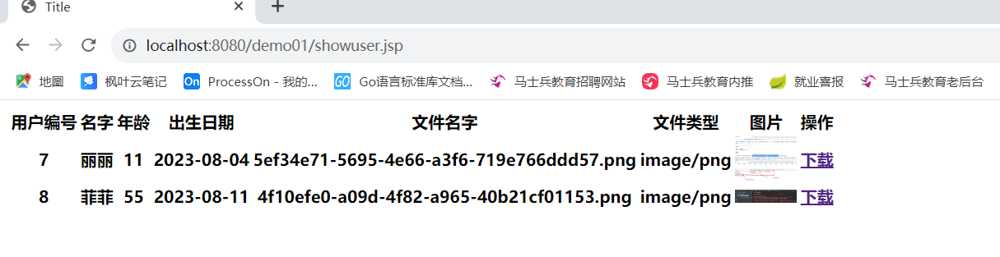

## 文件下载

下载的逻辑：目前图片是放置在服务器上的，下载的话是将图片从服务器下载到本地盘符中。点击下载按钮，将图片名称传到后台，发送请求到后端进行下载。


前端处理：showuser.jsp:

```jsp
<%--
  Created by IntelliJ IDEA.
  User: zhaoss-msb
  Date: 2023/8/4
  Time: 17:55
  To change this template use File | Settings | File Templates.
--%>
<%@ page contentType="text/html;charset=UTF-8" language="java" %>
<html>
<head>
    <title>Title</title>
    <script type="text/javascript" src="js/jquery.js"></script>
    <script type="text/javascript">
        $(function () {
            $.ajax(
                {
                    type:"post",
                    url:"findAllUsers",
                    success:function(result){
                        $.each(result,function(i,e){
                            
                            $("#tb").append("<tr>\n"+
                                " <th>"+e.id+"</th>\n"+
                                " <th>"+e.name+"</th>\n"+
                                " <th>"+e.age+"</th>\n"+
                                "<th>"+e.birthdate+"</th>\n"+
                                "<th>"+e.filename+"</th>\n"+
                                "<th>"+e.filetype+"</th>\n"+
                                "<th></th>\n"+
                                "<th><a href='download?filename="+e.filename+"&filetype="+e.filetype+"'>下载</a></th>\n"+
                                "</tr>")// 新增：下载超链接的处理
                        })
                    }
                }
            )
        })
    </script>
</head>
<body>
<table>
    <tr>
        <th>用户编号</th>
        <th>名字</th>
        <th>年龄</th>
        <th>出生日期</th>
        <th>文件名字</th>
        <th>文件类型</th>
        <th>图片</th>
        <th>操作</th>
    </tr>
    <tbody id="tb"></tbody>
</table>


</body>
</html>

```


后端控制单元：

```java
package com.msb.controller;

import com.msb.pojo.LoginUser;
import com.msb.service.UserService;
import jakarta.servlet.ServletOutputStream;
import jakarta.servlet.http.HttpServletRequest;
import jakarta.servlet.http.HttpServletResponse;
import org.springframework.beans.factory.annotation.Autowired;
import org.springframework.stereotype.Controller;
import org.springframework.web.bind.annotation.RequestMapping;
import org.springframework.web.bind.annotation.ResponseBody;
import org.springframework.web.multipart.MultipartFile;

import java.io.*;
import java.util.*;

/**
 * @Author: zhaoss
 */
@Controller
public class MyController6 {
 
    @RequestMapping(value="/download")
    public void download(HttpServletRequest req, HttpServletResponse resp,String filename,String filetype) throws IOException {
        // 设置响应头和响应类型
        // 设置以后，浏览器会出现下载图片的效果
        resp.setHeader("Content-Disposition","attachment;filename=" + filename);
        resp.setContentType(filetype);


        // 【1】先将图片从服务器读过来：
        String realPath = req.getServletContext().getRealPath("/images");// 获取图片在服务器中的真实路径
        InputStream is = new FileInputStream(realPath + "/" + filename );
        // 【2】再将读过来的读片写入到服务器中：
        // 下面这种写法是错误的，如果这样写，你点击下载是将图片下载到我的本地了
        // OutputStream os = new FileOutputStream("d:/demo.png");
        // 我们要做的是写入到当前你的客户端：
        ServletOutputStream os = resp.getOutputStream();

        // 将读进来的内容写出到你的本地
        int n = is.read();
        while(n != -1){
            os.write(n);
            n = is.read();
        }

        os.close();
        is.close();
    }
}

```


## 拦截器

### 介绍

springmvc中的处理：

 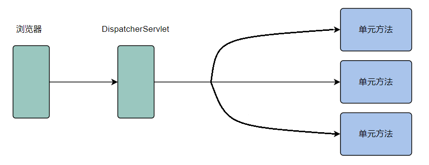

用户通过浏览器发送请求，会通过web.xml先进入到DisptcherServlet，先去找路径是否匹配，一般在DisptcherServlet路径我们会配置为/ ，比如你请求/test1，路径匹配，会去找到对应的控制单元的方法。

如果你想要在控制单元执行之前做点事情，可以怎么解决呢？

有人想到用过滤器，在javaee阶段我们学习过过滤器的使用， 使用 Filter 的完整流程： Filter 对用户请求进行预处理，接着将请求交给 Servlet 进行处理并生成响应，最后 Filter 再 对服务器响应进行后处理。过滤器的执行时机，是在Servlet之前执行的。

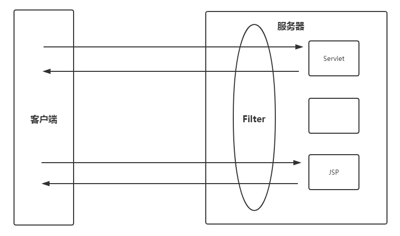

我们可以在过滤器中控制走入到不同的servlet/jsp/请求资源中。

但是在使用了SpringMVC后，Servlet只有一个了，也就是DisptcherServlet。如果你仍然使用过滤器来完成请求的拦截，就会造成，过滤器会拦截DispatcherServlet所有的请求。那么，如果我们有部分请求不想被拦截，怎么办呢？SpringMVC给出了拦截器来实现单元方法的拦截，拦截器的执行是在DispatcherServlet之后和单元方法之前的，这样我们就可以在单元方法被之前之前对请求进行自定义的拦截处理了。

<span style="color:red;font-weight:bold;">注意：只有URL匹配到了控制单元，拦截器才能生效</span>

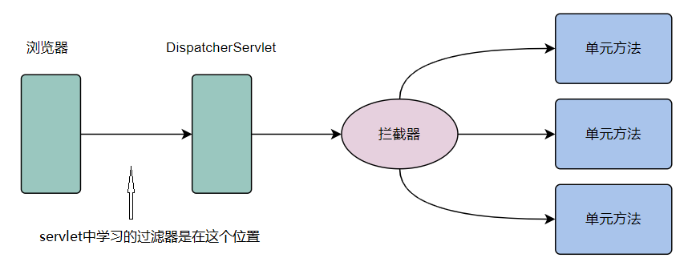

### 拦截器的使用-代码实现

#### 拦截器的定义方式

​     1.   通过实现HandlerInterceptor接口来定义。

2. 通过实现WebRequestInterceptor接口来定义。

```
public class MyInterceptor implements HandlerInterceptor{}、 ——> 推荐方式
public class MyInterceptor implements WebRequestInterceptor {}、
```

在com.msb.interceptor下创建拦截器：

```java
package com.msb.interceptor;


import jakarta.servlet.http.HttpServletRequest;
import jakarta.servlet.http.HttpServletResponse;
import org.springframework.web.servlet.HandlerInterceptor;
import org.springframework.web.servlet.ModelAndView;

/**
 * @Author: zhaoss
 */
public class MyInterceptor implements HandlerInterceptor {
    /*
    先重写三个方法，先不用考虑三个方法的作用，我们先关注三个方法的执行时机即可
     */
    @Override
    public boolean preHandle(HttpServletRequest request, HttpServletResponse response, Object handler) throws Exception {
        System.out.println("preHandle");
        return false;
    }

    @Override
    public void postHandle(HttpServletRequest request, HttpServletResponse response, Object handler, ModelAndView modelAndView) throws Exception {
        System.out.println("postHandle");
    }

    @Override
    public void afterCompletion(HttpServletRequest request, HttpServletResponse response, Object handler, Exception ex) throws Exception {
        System.out.println("afterCompletion");
    }
}


```

#### 配置拦截器

拦截器是给哪个控制单元加的呢？需要在springmvc中配置拦截器。

```xml
<?xml version="1.0" encoding="UTF-8"?>
<beans xmlns="http://www.springframework.org/schema/beans"
       xmlns:mvc="http://www.springframework.org/schema/mvc"
       xmlns:xsi="http://www.w3.org/2001/XMLSchema-instance"
       xmlns:context="http://www.springframework.org/schema/context"
       xsi:schemaLocation="http://www.springframework.org/schema/beans
		https://www.springframework.org/schema/beans/spring-beans.xsd
        http://www.springframework.org/schema/context
        https://www.springframework.org/schema/context/spring-context.xsd
        http://www.springframework.org/schema/mvc
        https://www.springframework.org/schema/mvc/spring-mvc.xsd">

    <!-- 扫描控制器类，千万不要把service等扫描进来，也千万不要在Spring配置文件扫描控制器类所在包 -->
    <context:component-scan base-package="com.msb.controller"></context:component-scan>
    <!-- 让Spring MVC的注解生效 ：@RequestMapping，这个位置别忘记加入mvc的命名空间-->
    <mvc:annotation-driven></mvc:annotation-driven>
    <!-- 静态资源放行-->
    <mvc:resources mapping="/js/**" location="/js/"></mvc:resources>
    <mvc:resources mapping="/images/**" location="/images/"></mvc:resources>

    <!-- 文件上传时，必须配置文件解析器 -->
    <bean id="multipartResolver" class="org.springframework.web.multipart.support.StandardServletMultipartResolver"></bean>


    <!--配置拦截器-->
    <mvc:interceptors>
        <!--配置具体的拦截器的bean及其拦截范围-->
        <mvc:interceptor>
            <mvc:mapping path="/testmi1" /><!--配置你要拦截的单元方法的访问路径，第一个/表示项目根目录-->
            <bean class="com.msb.interceptor.MyInterceptor"></bean><!--上面路径对应的拦截器是哪个-->
            <!--配置拦截器的bean对象，只在当前mvc:interceptor内有效-->
        </mvc:interceptor>
    </mvc:interceptors>
</beans>
```

#### 编写控制单元

```java
package com.msb.controller;

import jakarta.servlet.annotation.MultipartConfig;
import jakarta.servlet.http.HttpServletRequest;
import org.springframework.stereotype.Controller;
import org.springframework.web.bind.annotation.RequestMapping;
import org.springframework.web.bind.annotation.ResponseBody;
import org.springframework.web.multipart.MultipartFile;

import java.io.File;
import java.io.IOException;
import java.util.HashMap;
import java.util.Map;
import java.util.Random;

/**
 * @Author: zhaoss
 */
@Controller
public class MyController7 {
    @RequestMapping(value="/testmi1")
    public String testmi1() throws IOException { 
        System.out.println("进入控制单元");
        return "/index.jsp";
    }

}

```

#### 测试

启动服务器，访问http://localhost:8080/demo01/testmi1看结果：

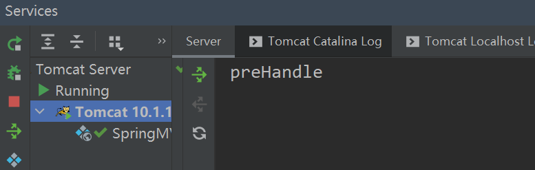

发现控制单元没有进，所以能感受到拦截器中的preHandle方法是进入控制单元方法之前执行的。

那么如果想要控制单元执行，怎么处理呢？将preHandle中的返回值变为true：

```java
@Override
public boolean preHandle(HttpServletRequest request, HttpServletResponse response, Object handler) throws Exception {
    System.out.println("preHandle");
    return true;//该返回值决定了控制单元是否进入执行
}
```

重启，运行结果：

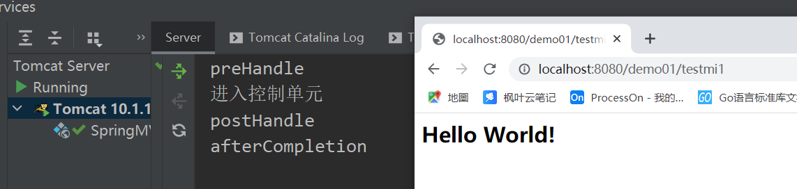

可以看出上面三个方法都是围绕控制单元执行的。

### 拦截方法介绍

#### preHandle方法

**执行时机：**

进入控制单元方法之前执行。

**作用：**

真正执行拦截的方法，返回false表示拦截此次请求，返回true表示放行。

**参数:**

​		HttpServletRequest request:此次拦截的请求的request对象

​		HttpServletResponse response:此次拦截的请求的response对象

​		Object handler:HandlerMethod类型，存储了拦截的单元方法的method对象。（拦截的控制单元的方法对应的对象）

**返回值：**

​			boolean类型，false表示拦截，true表示放行。

**案例：**

在preHandle方法中加入维护页面，比如你控制单元/testmi1要进行某个功能的升级，升级的时候并不想让其它人访问，如果访问的话可以走维护页面，那么就可以在preHandle方法中进行处理。

先定义维护页面：wh.jsp:

```jsp
<%--
  Created by IntelliJ IDEA.
  User: zhaoss-msb
  Date: 2023/8/7
  Time: 18:02
  To change this template use File | Settings | File Templates.
--%>
<%@ page contentType="text/html;charset=UTF-8" language="java" %>
<html>
<head>
    <title>Title</title>
</head>
<body>
    系统升级中，请稍后访问
</body>
</html>

```

拦截器：

```java
package com.msb.interceptor;


import jakarta.servlet.http.HttpServletRequest;
import jakarta.servlet.http.HttpServletResponse;
import org.springframework.web.servlet.HandlerInterceptor;
import org.springframework.web.servlet.ModelAndView;

/**
 * @Author: zhaoss
 */
public class MyInterceptor implements HandlerInterceptor {
    /*
    先重写三个方法，先不用考虑三个方法的作用，我们先关注三个方法的执行时机即可
     */
    @Override
    public boolean preHandle(HttpServletRequest request, HttpServletResponse response, Object handler) throws Exception {
        System.out.println("preHandle");
        // 进行页面维护操作，拦截进入到维护页面：
        response.sendRedirect("/demo01/wh.jsp");
        // 进入维护页面，不需要走入单元方法中，返回值定义为false
        return false;
    }
}


```

访问http://localhost:8080/demo01/testmi1，结果：

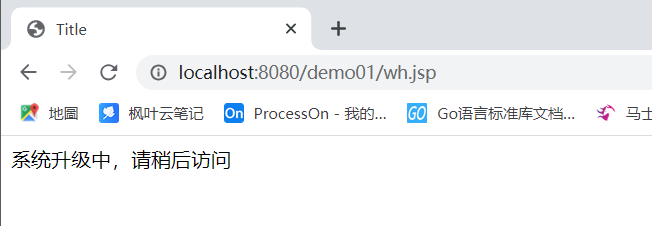

#### postHandle方法

**执行时机:**

​		单元方法之后，转发的视图资源之前。

**作用:**

​		对单元方法转发的资源进行拦截，可以对model中的数据进行校验等。

**参数:**

​		HttpServletRequest request:此次拦截的请求的request对象。

​		HttpServletResponse response:此次拦截的请求的response对象。

​		Object handler:HandlerMethod类型，存储了拦截的单元方法的method对象。

​		ModelAndView: 存储了model和view信息的对象。

**案例：**控制单元跳转到index.jsp页面，并将数据存入request作用域中，然后再index.jsp中显示，但是要防止出现恶意字符，会对恶意敏感字符进行替换为** 。

控制单元：

```java
package com.msb.controller;

import org.springframework.stereotype.Controller;
import org.springframework.web.bind.annotation.RequestMapping;
import java.io.IOException;
import java.util.Map;

/**
 * @Author: zhaoss
 */
@Controller
public class MyController7 {
    @RequestMapping(value="/testmi1")
    public String testmi1(Map map) throws IOException {
        System.out.println("进入控制单元");
        // 模拟数据库中查出来的数据，存入request作用域：
        map.put("msg","TMD");
        return "/index.jsp";
    }

}

```

index.jsp:

```jsp
<%@ page contentType="text/html;charset=UTF-8" language="java" %>
<html>
<body>
<h2>Hello World!</h2>
</body>
request作用域取值：${requestScope.msg}
</html>

```

拦截器处理：

```java
package com.msb.interceptor;


import jakarta.servlet.http.HttpServletRequest;
import jakarta.servlet.http.HttpServletResponse;
import org.springframework.web.servlet.HandlerInterceptor;
import org.springframework.web.servlet.ModelAndView;

import java.util.Map;

/**
 * @Author: zhaoss
 */
public class MyInterceptor implements HandlerInterceptor {

	@Override
    public boolean preHandle(HttpServletRequest request, HttpServletResponse response, Object handler) throws Exception {
        System.out.println("preHandle");
        return true;
    }
    @Override
    public void postHandle(HttpServletRequest request, HttpServletResponse response, Object handler, ModelAndView modelAndView) throws Exception {
        System.out.println("postHandle");
        // ModelAndView就是底层执行转发重定向的对象
        // getModel返回的Map集合就是我们在控制单元中使用的那个：
        Map<String, Object> map = modelAndView.getModel();
        // 获取集合中存储信息：
        String msg = (String)map.get("msg");
        // 对敏感词汇进行过滤：
        if (msg.contains("MD")){
            // 替换敏感字符为*
            String s = msg.replaceAll("MD", "**");
            map.put("msg",s);
        }
    }
}
```

结果：

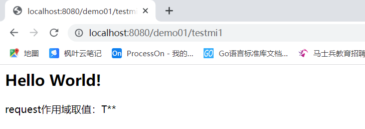

#### afterCompletion方法

**作用:**

​		对整个拦截流程中的异常信息进行捕捉处理。

​		进行一些扫尾工作：如资源的关闭、垃圾的回收等。

**执行时机:**

​		处理完视图和模型数据，渲染视图完毕之后执行。

**参数:**

​		HttpServletRequest request:此次拦截的请求的request对象。

​		HttpServletResponse response:此次拦截的请求的response对象。

​		Object handler:HandlerMethod类型，存储了拦截的单元方法的method对象。

​		 Exception：存储异常信息的对象，如果没有异常信息则默认为null。

**案例：**把异常信息打印一下：

控制单元中制造一个异常：

```java
package com.msb.controller;

import org.springframework.stereotype.Controller;
import org.springframework.web.bind.annotation.RequestMapping;
import java.io.IOException;
import java.util.Map;

/**
 * @Author: zhaoss
 */
@Controller
public class MyController7 {
    @RequestMapping(value="/testmi1")
    public String testmi1(Map map){
        int a = 1/0; // 制造异常
        return "/index.jsp";
    }

}

```

拦截器处理：输出异常：

```java
package com.msb.interceptor;


import jakarta.servlet.http.HttpServletRequest;
import jakarta.servlet.http.HttpServletResponse;
import org.springframework.web.servlet.HandlerInterceptor;
import org.springframework.web.servlet.ModelAndView;

import java.util.Map;

/**
 * @Author: zhaoss
 */
public class MyInterceptor implements HandlerInterceptor {
    @Override
    public void afterCompletion(HttpServletRequest request, HttpServletResponse response, Object handler, Exception ex) throws Exception {
        System.out.println("afterCompletion");
        System.out.println(ex); // 输出异常
    }
}
```

后台结果：

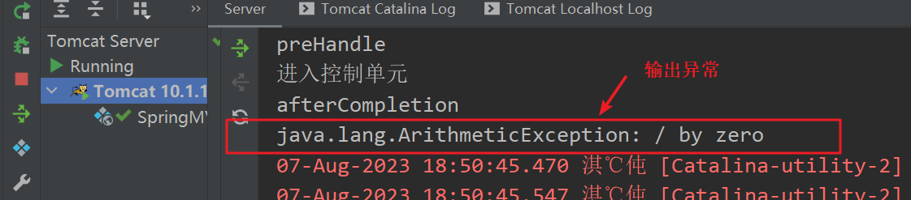

### 拦截器配置说明

之前的拦截器配置为：

```xml
    <!--配置拦截器-->
    <mvc:interceptors>
        <!--配置具体的拦截器的bean及其拦截范围-->
        <mvc:interceptor>
            <mvc:mapping path="/testmi1" /><!--配置你要拦截的单元方法的访问路径，第一个/表示项目根目录-->
            <bean class="com.msb.interceptor.MyInterceptor"></bean><!--上面路径对应的拦截器是哪个-->
            <!--配置拦截器的bean对象，只在当前mvc:interceptor内有效-->
        </mvc:interceptor>
    </mvc:interceptors>
```

如果，控制单元都想都这个拦截器，那么可以配置为：

```xml
	<!--配置拦截器-->    
	<mvc:interceptors>
        <mvc:interceptor>
            <mvc:mapping path="/*" />
            <bean class="com.msb.interceptor.MyInterceptor"></bean>
        </mvc:interceptor>
    </mvc:interceptors>
```

也可以修改为如下，将拦截器变为全局拦截器：

```xml
    <mvc:interceptors>
        <bean class="com.msb.interceptor.MyInterceptor"></bean>
    </mvc:interceptors>
```

### 多个拦截器执行顺序

多个拦截器同时存在时，执行的顺序由配置顺序决定，先配置谁，谁就先执行。


控制单元：

```java
@Controller
public class MyController8 {
    @RequestMapping(value="/testmi2")
    public String testmi2() throws IOException {
        System.out.println("进入控制单元testmi2");
        return "/index.jsp";
    }
}

```

拦截器1：

```java
package com.msb.interceptor;


import jakarta.servlet.http.HttpServletRequest;
import jakarta.servlet.http.HttpServletResponse;
import org.springframework.web.servlet.HandlerInterceptor;
import org.springframework.web.servlet.ModelAndView;

import java.util.Map;

/**
 * @Author: zhaoss
 */
public class MyInterceptor1 implements HandlerInterceptor {
    /*
    先重写三个方法，先不用考虑三个方法的作用，我们先关注三个方法的执行时机即可
     */
    @Override
    public boolean preHandle(HttpServletRequest request, HttpServletResponse response, Object handler) throws Exception {
        System.out.println("preHandle1");
        return true;
    }

    @Override
    public void postHandle(HttpServletRequest request, HttpServletResponse response, Object handler, ModelAndView modelAndView) throws Exception {
        System.out.println("postHandle1");
    }

    @Override
    public void afterCompletion(HttpServletRequest request, HttpServletResponse response, Object handler, Exception ex) throws Exception {
        System.out.println("afterCompletion1");
    }
}


```


拦截器2：

```java
package com.msb.interceptor;


import jakarta.servlet.http.HttpServletRequest;
import jakarta.servlet.http.HttpServletResponse;
import org.springframework.web.servlet.HandlerInterceptor;
import org.springframework.web.servlet.ModelAndView;

/**
 * @Author: zhaoss
 */
public class MyInterceptor2 implements HandlerInterceptor {
    /*
    先重写三个方法，先不用考虑三个方法的作用，我们先关注三个方法的执行时机即可
     */
    @Override
    public boolean preHandle(HttpServletRequest request, HttpServletResponse response, Object handler) throws Exception {
        System.out.println("preHandle2");
        return true;
    }

    @Override
    public void postHandle(HttpServletRequest request, HttpServletResponse response, Object handler, ModelAndView modelAndView) throws Exception {
        System.out.println("postHandle2");
    }

    @Override
    public void afterCompletion(HttpServletRequest request, HttpServletResponse response, Object handler, Exception ex) throws Exception {
        System.out.println("afterCompletion2");
    }
}


```

配置拦截器：（springmvc.xml中）

```xml
    <mvc:interceptors>
        <mvc:interceptor>
            <mvc:mapping path="/testmi2" /> 
            <bean class="com.msb.interceptor.MyInterceptor1"></bean> 
        </mvc:interceptor>
        <mvc:interceptor>
            <mvc:mapping path="/testmi2" />
            <bean class="com.msb.interceptor.MyInterceptor2"></bean>
        </mvc:interceptor>
    </mvc:interceptors>
```

运行http://localhost:8080/demo01/testmi2访问：

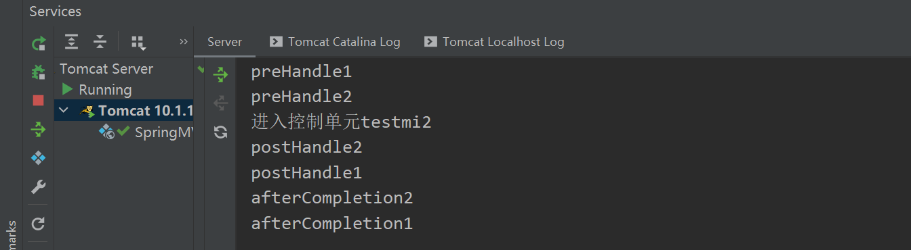

为了便于理解结果可以想象为如下：

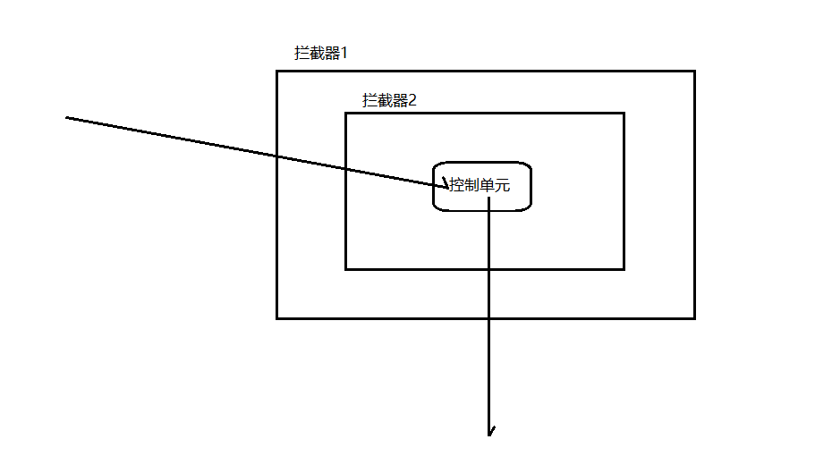

## Spring MVC异常处理

### 介绍

在Spring MVC支持异常处理，不会呈现给用户异常界面，而是当出现异常时交给某个特定的控制器。

如：一个上线的项目，呈现了500界面，会非常影响用户体验度。同时也显示公司实力有问题、不专业。

控制单元：

```java
/**
 * @Author: zhaoss
 */
@Controller
public class MyController9 {
    @RequestMapping(value="/testexcep")
    public String testexcep() throws IOException {
        System.out.println("进入控制单元testexcep");
        int num = 10 / 0;
        return "/index.jsp";
    }
}

```

访问：

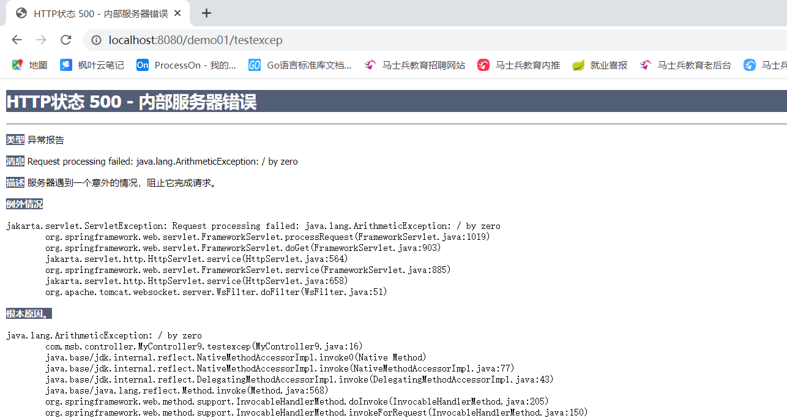


### 解决方式1：局部配置（基于注解）

出现异常以后，不让用户看到异常错误界面，而是跳转到某个指定的界面。实现:

控制单元：

```java
package com.msb.controller;

import org.springframework.stereotype.Controller;
import org.springframework.web.bind.annotation.ExceptionHandler;
import org.springframework.web.bind.annotation.RequestMapping;

import java.io.IOException;

/**
 * @Author: zhaoss
 */
@Controller
public class MyController9 {
    @RequestMapping(value="/testexcep")
    public String testexcep() throws IOException {
        System.out.println("进入控制单元testexcep");
        int num = 10 / 0;
        return "/index.jsp";
    }


    // 加入下面方法（异常处理器），如果出现该异常，就走入error.jsp页面
    @ExceptionHandler(value = {ArithmeticException.class, NullPointerException.class})
    public String myexception(){
        return "redirect:/error.jsp";
    }
}

```

error.jsp:

```java
<%--
  Created by IntelliJ IDEA.
  User: zhaoss-msb
  Date: 2023/8/7
  Time: 19:35
  To change this template use File | Settings | File Templates.
--%>
<%@ page contentType="text/html;charset=UTF-8" language="java" %>
<html>
<head>
    <title>Title</title>
</head>
<body>
页面出现错误，请联系管理员。
</body>
</html>

```

访问http://localhost:8080/demo01/testexcep：

结果：

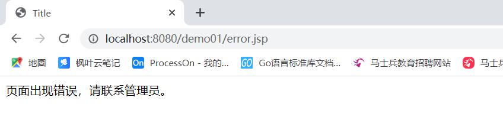

上面的方式，配置在控制器类中，只有当前这个控制器类的控制单元出现异常时才能执行，其他类的控制单元出现异常不能执行。

每个控制器类中可以有多个处理异常的方法，每个方法上面只需要有@ExceptionHandler，千万别添加了@RequestMapping注解。


### 解决方式2：全局配置 -使用@ControllerAdvice注解方式（基于注解）

全局配置方式，对所有控制单元的所有方法都生效。

```java
package com.msb.controller;

import org.springframework.web.bind.annotation.ControllerAdvice;
import org.springframework.web.bind.annotation.ExceptionHandler;

/**
 * @Author: zhaoss
 */
@ControllerAdvice
public class MyExceptionController {
    @ExceptionHandler(value = ArithmeticException.class)
    public String myexception(){
        return "/error.jsp";
    }
}
```


因为@ControllerAdvice已经继承了@Component注解，所以类上只添加这个注解就可以了。

不需要在添加@Controller注解了。

控制单元：

```java
package com.msb.controller;

import org.springframework.stereotype.Controller;
import org.springframework.web.bind.annotation.ExceptionHandler;
import org.springframework.web.bind.annotation.RequestMapping;

import java.io.IOException;

/**
 * @Author: zhaoss
 */
@Controller
public class MyController9 {
    @RequestMapping(value="/testexcep")
    public String testexcep() throws IOException {
        System.out.println("进入控制单元testexcep");
        int num = 10 / 0;
        return "/index.jsp";
    }

}

```


访问即可处理：


小提示：

​	如果配置了局部异常处理器和全局异常处理器，优先匹配局部异常处理器。


### 解决方式3：全局配置-使用配置文件配置 （基于配置文件）

在Spring MVC中包含HandlerExceptionResolver组件，专门负责处理异常的，接口中只包含一个resolveException方法。

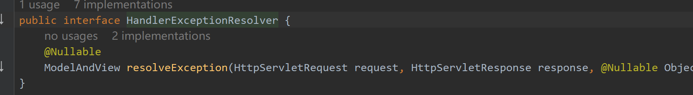

程序员可以自行对接口实现，也可以使用Spring MVC提供的实现。

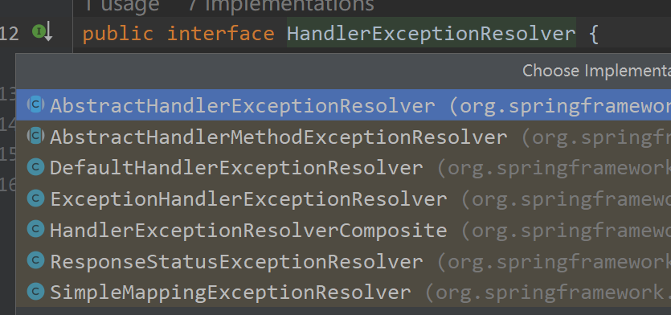

其中最简单好用的就是SimpleMappingExceptionResolver，里面有个全局属性exceptionMappings,表示当出现了什么类型异常时跳转到指定的页面。

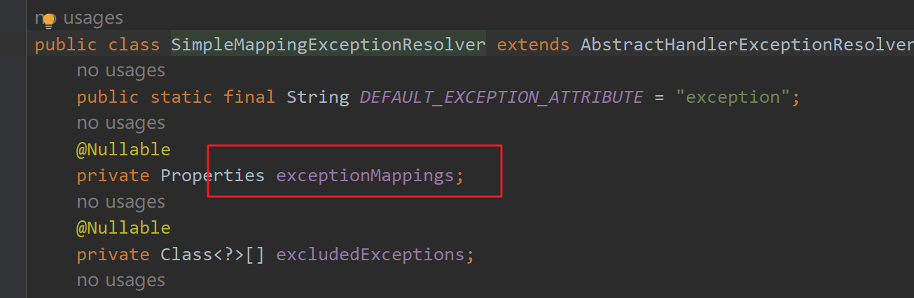

想要在异常出现时跳转到指定页面，只需要在springmvc.xml文件中添加异常解析器即可。（配置文件优先级低于注解的方式）

下面的配置表示当出现空指针异常时跳转到/error1.jsp，算术异常都跳转到/error2.jsp

```xml
<bean class="org.springframework.web.servlet.handler.SimpleMappingExceptionResolver">
        <property name="exceptionMappings">
            <props>
                <prop key="java.lang.NullPointerException">/error1.jsp</prop>
                <prop key="java.lang.ArithmeticException">/error2.jsp</prop>
            </props>
        </property>
    </bean>
```

控制单元：

```java
package com.msb.controller;

import org.springframework.stereotype.Controller;
import org.springframework.web.bind.annotation.ExceptionHandler;
import org.springframework.web.bind.annotation.RequestMapping;

import java.io.IOException;

/**
 * @Author: zhaoss
 */
@Controller
public class MyController9 {
    @RequestMapping(value="/testexcep")
    public String testexcep() throws IOException {
        System.out.println("进入控制单元testexcep");
        int num = 10 / 0;
        return "/index.jsp";
    }
}

```

### 解决方式4：根据状态码跳转到指定页面

在Spring MVC框架中没有提供根据状态码跳转到特定的视图。想要实现根据状态码跳转到指定页面可以使用Java EE中提供的实现方案，在web.xml中配置，这种方案不需要依赖任何框架。

```xml
 <error-page>
    <error-code>500</error-code>
    <location>/error.jsp</location>
  </error-page>
  <error-page>
    <error-code>404</error-code>
    <location>/index.jsp</location>
  </error-page>
```

## 国际化支持

i18n是internationalization（国际化）的缩写。因为单词比较长，取首字母i和末字母n，中间还有18个字母，所以叫做i18n。

国际化主要是让同一个项目，在不做任何修改的情况下，在不同语言环境中显示不同语言文字。

如下面的页面，在中文环境下显示中文，在英文环境下显示英文：

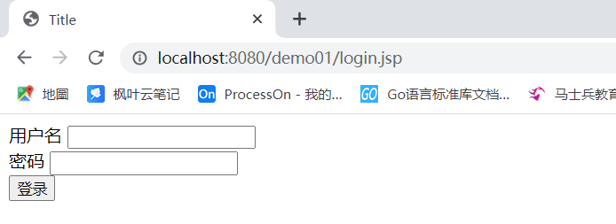

Spring MVC的国际化底层是通过LocaleResolver区域解析器来解析用户所在区域。根据区域判断使用哪种语言。

LocaleResolver所有实现类都在org.springframework.web.servlet.i18n包中。

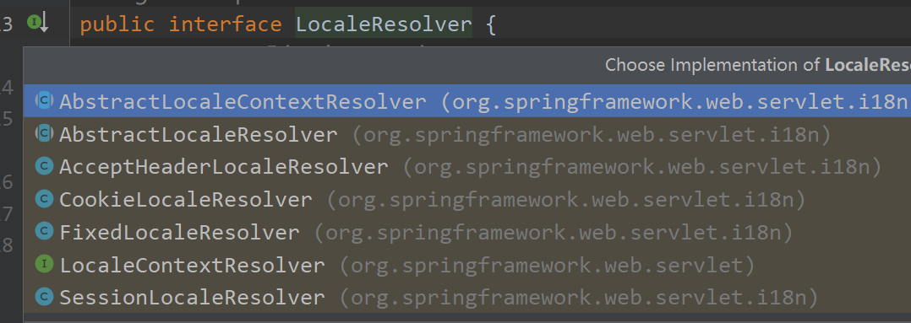

里面有四个能用的实现类

（1）AcceptHeaderLocaleResolver：根据请求头判断时区

（2）SessionLocaleResolver：根据Session判断时区

（3）CookieLocaleResolver：根据Cookie判断时区

（4）FixedLocaleResolver：固定时区

这些实现类都能实现国际化效果，主要区别是实现方式不相同。因为AcceptHeaderLocaleResolver是默认的LocaleResolver，且适用面比较广。所以使用AcceptHeaderLocaleResolver给同学们讲解国际化的实现

### AcceptLanguageLocaleResolver实现国际化

#### AcceptLanguageLocaleResolver实现原理介绍

AcceptLanguageLocaleResolver是根据请求头的Accept-Language进行判断使用哪种语言进行显示。

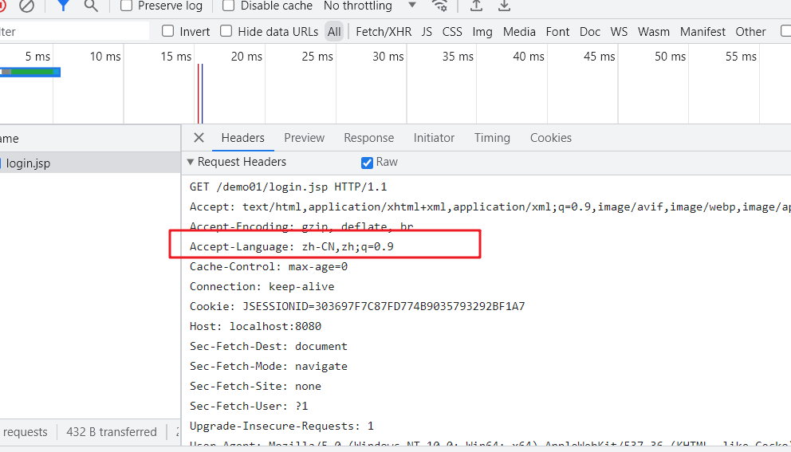

在Accept-Language中可以有多个可接受的语言，具体需要看自己的浏览器设置。以谷歌浏览器举例：

点击谷歌浏览器右上角三个点 - > 点击设置

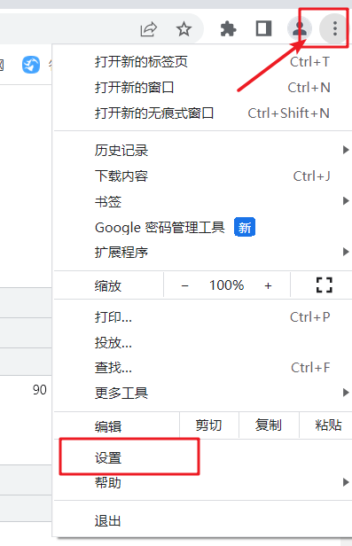

在设置页面中分别点击高级 -> 语言 -> 语言 -> 添加语言 可以添加一个新的语言。

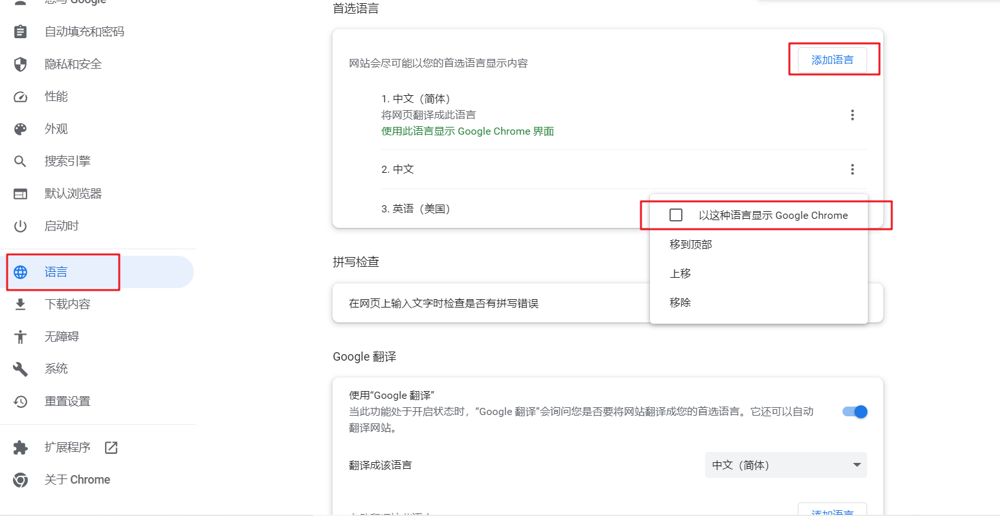

在默认情况下可以看到，谷歌浏览器有中文(简体)、中文，所以请求头的Accept-Language里面只有zh-CN(中文的缩写),zh。

在添加页面中添加一个英语（美国）后，请求头的Accept-Language里面: en-US,en;q=0.9,zh-CN;q=0.8,zh;q=0.7

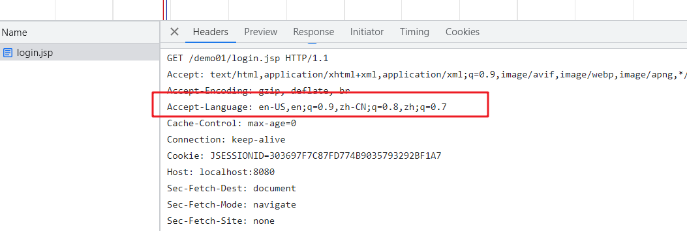

这些语言有着严格的顺序要求，可以点击语言右侧的三个点让语言上移或下移。谁在上面，表示谁的优先级更高。

如果希望浏览器变成英文浏览器可以点击语言右侧的三个点，然后选中以这种该语言显示Google Chrome。这样做了之后，当前界面和设置中的文字都变成了设置的语言。


#### 代码实现步骤

##### 新建配置文件

在src/main/resources中新建属性文件。属性文件语法：`任意名_语言_国家.properties`。例如：中文是zh、英文是en。如果为了更加精确是哪国使用的这个语言，可以在后面添加国家，因为美式英语和英式英语是不一样的。中国：CN、美国是US，国家缩写都是大写的。

新建suiyi_zh_CN.properties

```properties
msb.username=用户名
msb.password=密码
msb.submit=登录
```

新建suiyi_en_US.properties

```properties
msb.username=username
msb.password=password
msb.submit=login
```

文件中key是自定义的，msb.username这就是key，随意起。但是value要和语言对应。所以在suiyi_en_US.properties的msb.username的value值是英文的，在suiyi_zh_CN.properties中msb.username的值是中文的。

同时要保证不同的properties文件的key是相同的。因为Spring MVC会根据语言环境自动获取不同文件中指定名称（key）对应的值。

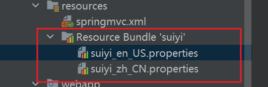

##### 添加配置

在springmvc.xml中添加额外配置。因为属性文件名称是随意起的，所以需要明确告诉Spring MVC国际化资源文件名称。只需要写名称不需要写后面的语言和国家缩写。

AcceptHeaderLocaleResolver是默认的LocaleResolver可以不配置，id属性可以省略也可以换成其他名称。

ResourceBundleMessageSource的id属性不能省略，且必须叫做messageSource。换名或省略id都会导致properties无法被加载。

```xml
    <!-- 加载属性文件 -->
    <bean id="messageSource" class="org.springframework.context.support.ResourceBundleMessageSource">
        <property name="basename" value="suiyi"></property>   <!-- 需要明确告诉Spring MVC国际化资源文件名称 -->
    </bean>
    <!-- 默认也是AcceptHeaderLocaleResolver，所以可以不配置-->
    <bean id="localeResovler" class="org.springframework.web.servlet.i18n.AcceptHeaderLocaleResolver"></bean>
```

##### 新建控制单元

新建控制单元方法。该方法负责显示页面。

想让国际化生效，必须保证使用了Spring MVC框架。具体效果：必须先走控制器，转发到页面。直接访问JSP页面国际化无效。因为直接访问JSP文件是不通过Spring MVC的，而国际化是Spring MVC这里提供的功能。

```java
package com.msb.controller;

import org.springframework.stereotype.Controller;
import org.springframework.web.bind.annotation.RequestMapping;

import java.io.IOException;

/**
 * @Author: zhaoss
 */
@Controller
public class MyController10 {
    @RequestMapping("/showForm")
    public String showForm(){
        return "/login.jsp";
    }
}

```

##### 新建页面

在webapp目录下新建login.jsp.

此处需要注意：

（1）在上面使用taglib执行引入标签库

（2）`<spring:message code="属性文件的key"></spring:message>`根据语言环境负责加载属性文件中key的值。中文环境就加载suiyi_zh_CN.properties文件内容，英文环境就加载suiyi_en_US.properties文件内容

```jsp
<%--
  Created by IntelliJ IDEA.
  User: zhaoss-msb
  Date: 2023/8/7
  Time: 20:22
  To change this template use File | Settings | File Templates.
--%>
<%@ page contentType="text/html;charset=UTF-8" language="java" %>
<%@ taglib prefix="spring" uri="http://www.springframework.org/tags" %>
<html>
<head>
    <title>Title</title>
</head>
<body>
<form action="" method="post">
    <spring:message code="msb.username"></spring:message> <input type="text" name="username"/><br/>
    <spring:message code="msb.password"></spring:message> <input type="text" name="password"/><br/>
    <input type="submit" value="<spring:message code="msb.submit"></spring:message>"/>
</form>
</body>
</html>

```

#### 测试

**如果浏览器是英文环境：**

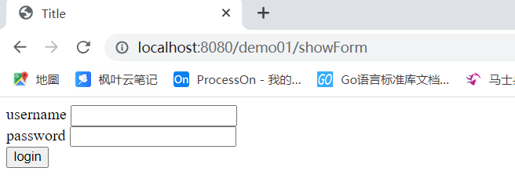

**如果浏览器是中文环境：**

在浏览器地址栏输入http://localhost:8080/demo01/showForm

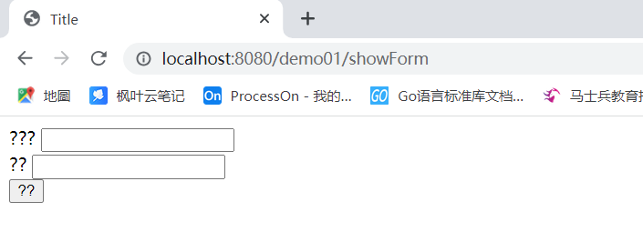

会发现文字不能正常显示，为乱码状态，需要设置properties文件编码：

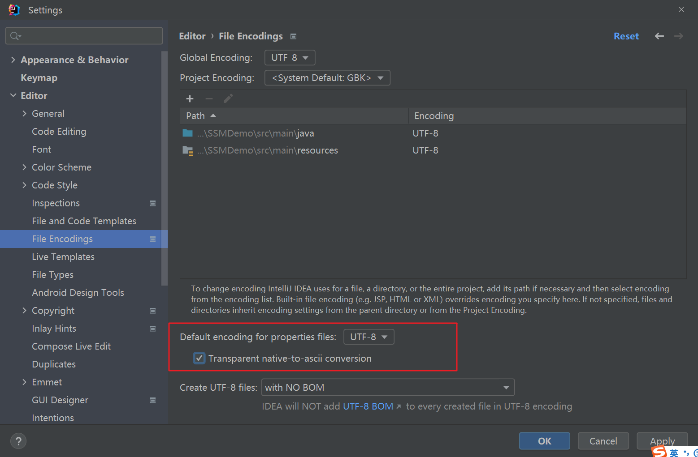

设置完编码后会发现suiyi_zh_CN.properties文件里面内容变成了乱码，需要重新填写一下value值。

```
msb.username=用户名
msb.password=密码
msb.submit=登录
```

修改后重启项目再次测试效果：

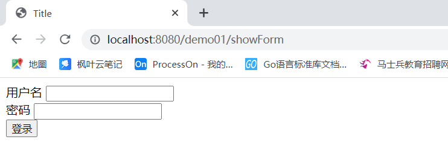